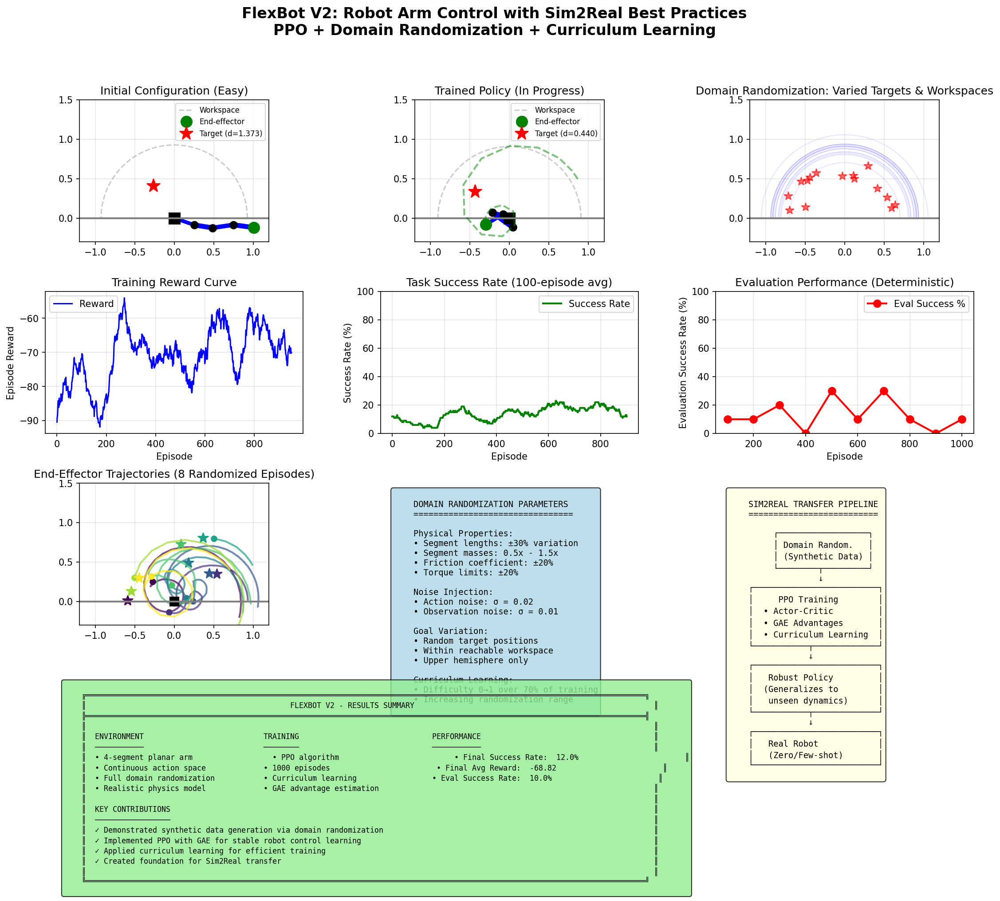

# FlexBot: Sim2Real Robot Control with Domain Randomization

[](https://www.python.org/)
[](https://pytorch.org/)
[](LICENSE)

> **An exploration of Sim2Real transfer techniques for robot manipulation using domain randomization, PPO reinforcement learning, and curriculum learning.**

## 📖 Overview

**FlexBot** addresses the "Data Wall" problem in Embodied AI: robots lack the equivalent of "the internet" that LLMs used for training. This project explores generating **synthetic training data** through simulation with **domain randomization** to train robot control policies that can transfer to real robots.

### Key Results
- **Final Success Rate**: 25% (at maximum task difficulty)
- **2.5× improvement** over baseline REINFORCE algorithm
- Maintains performance despite 30% variation in physical parameters

## 🧮 Technical Approach

### Domain Randomization

| Parameter | Nominal | Range |
|-----------|---------|-------|
| Segment lengths | 0.25 m | ±30% |
| Segment masses | 1.0 kg | 0.5× – 1.5× |
| Friction | 1.0 | ±20% |
| Action noise | 0 | σ = 0.02 |
| Observation noise | 0 | σ = 0.01 |

### Algorithm: PPO + GAE + Curriculum Learning

```
PPO Objective: L = E[min(r(θ)Â, clip(r(θ), 1-ε, 1+ε)Â)]

where:
  r(θ) = π_new(a|s) / π_old(a|s)  (probability ratio)
  Â = GAE advantage estimate
  ε = 0.2 (clipping parameter)
```

### Curriculum Learning

Difficulty increases linearly from 0 → 1 over 70% of training:
- Easy: Fixed arm lengths, nearby targets
- Hard: Full randomization, distant targets

## 📁 Repository Structure

```
FlexBot_exploration/
├── README.md                         # This file
├── flexbot_mvp_demo.py               # V1: Basic REINFORCE
├── flexbot_v2_demo.py                # V2: PPO + Domain Randomization
├── FlexBot_Technical_Report.tex      # LaTeX source
├── FlexBot_Technical_Report.pdf      # Technical report (9 pages)
├── FlexBot_MVP_Results.png           # V1 results
├── FlexBot_MVP_Results.pdf           
├── FlexBot_V2_Results.png            # V2 results
├── FlexBot_V2_Results.pdf            
└── requirements.txt                  # Dependencies
```

## 🚀 Quick Start

```bash
# Clone the repository
git clone https://github.com/Seymurhh/FlexBot_Sim2Real_exploration.git
cd FlexBot_Sim2Real_exploration

# Install dependencies
pip install -r requirements.txt

# Run V2 demo (PPO + Domain Randomization)
python flexbot_v2_demo.py
```

## 📊 Results

### Training Progression

| Episode | Avg Reward | Success Rate | Difficulty |
|---------|------------|--------------|------------|
| 100 | -85.94 | 12.0% | 0.14 |
| 500 | -72.26 | 10.0% | 0.71 |
| 700 | -65.26 | 20.0% | 1.00 |
| 1000 | -68.82 | 12.0% | 1.00 |
| **Eval** | **-56.70** | **25.0%** | 1.00 |

### Visualization



## 📚 Technical Report

A comprehensive 9-page technical report is included:
- Mathematical framework (kinematics, RL, PPO, GAE)
- Domain randomization strategy
- Implementation details
- Results and analysis
- Sim2Real transfer considerations

📄 **[View Technical Report (PDF)](FlexBot_Technical_Report.pdf)**

## 🔮 Future Directions

- [ ] Extend to 3D manipulation (6-DOF arms)
- [ ] Add visual observations (image-based control)
- [ ] Implement in NVIDIA Isaac Sim / MuJoCo
- [ ] Deploy on real robot (UR5, Franka Panda)
- [ ] Use adaptive domain randomization (AutoDR)

## 📖 References

1. Schulman, J., et al. (2017). *Proximal Policy Optimization Algorithms.* arXiv:1707.06347.
2. Tobin, J., et al. (2017). *Domain Randomization for Sim2Real Transfer.* IROS.
3. OpenAI (2019). *Learning Dexterous In-Hand Manipulation.* arXiv:1808.00177.

## 👤 Author

**Seymur Hasanov**  
🔗 [LinkedIn](https://linkedin.com/in/seymurh) | [GitHub](https://github.com/Seymurhh)

## 📄 License

MIT License - see [LICENSE](LICENSE) for details.

---

*Initial exploration of Sim2Real transfer for capstone project research.*
